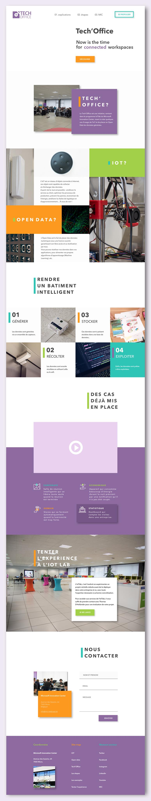

I worked at the Microsoft Innovation Center of Mons for a mission of 3 months. In this short period, my task was to discover the numerous IT projects of the students and learn how to represents theirs ideas in a way that would suits them.
My role was to highligh theirs projects by doing, for each of them, a graphic identity and a onepage website showing and explaining theirs ideas.

Here is one of them, about IOT improving the quality of work in an openspace.

