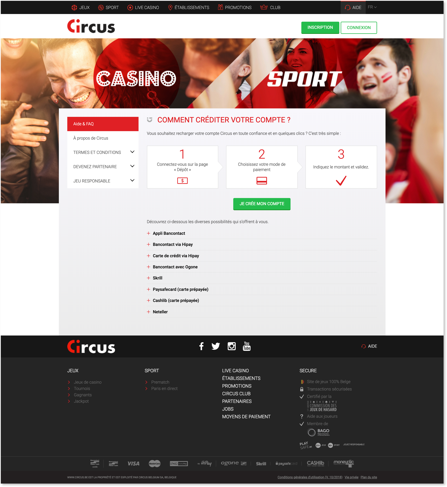
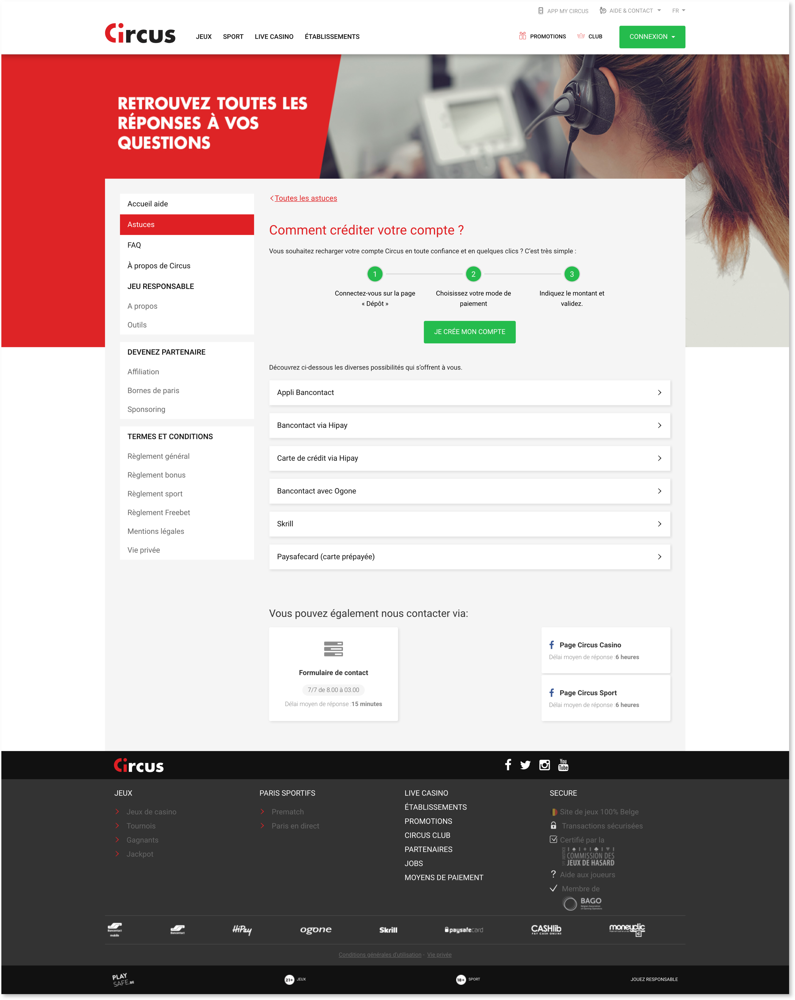
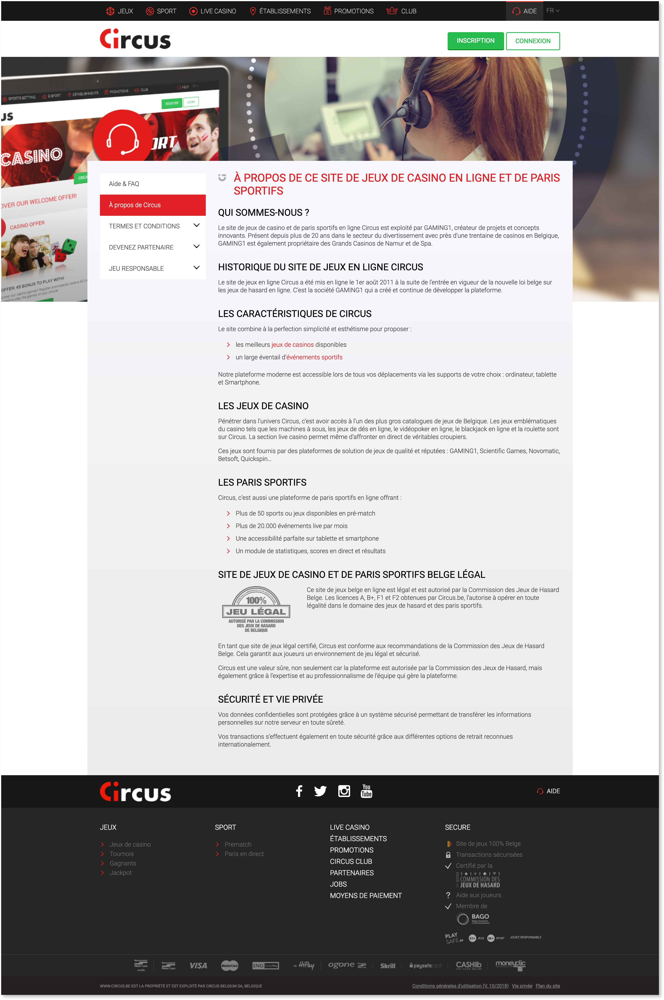
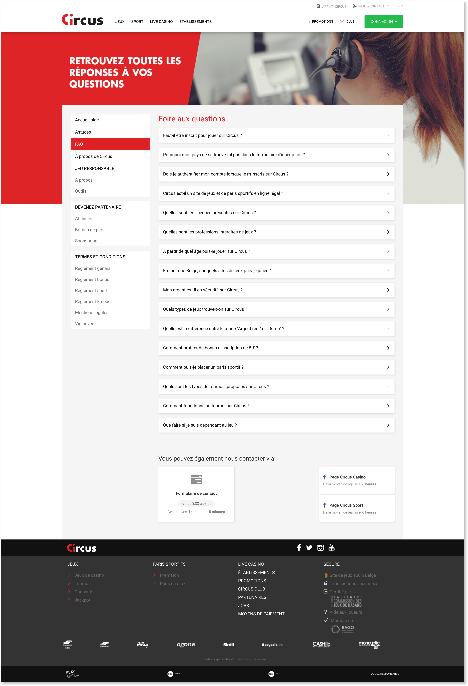
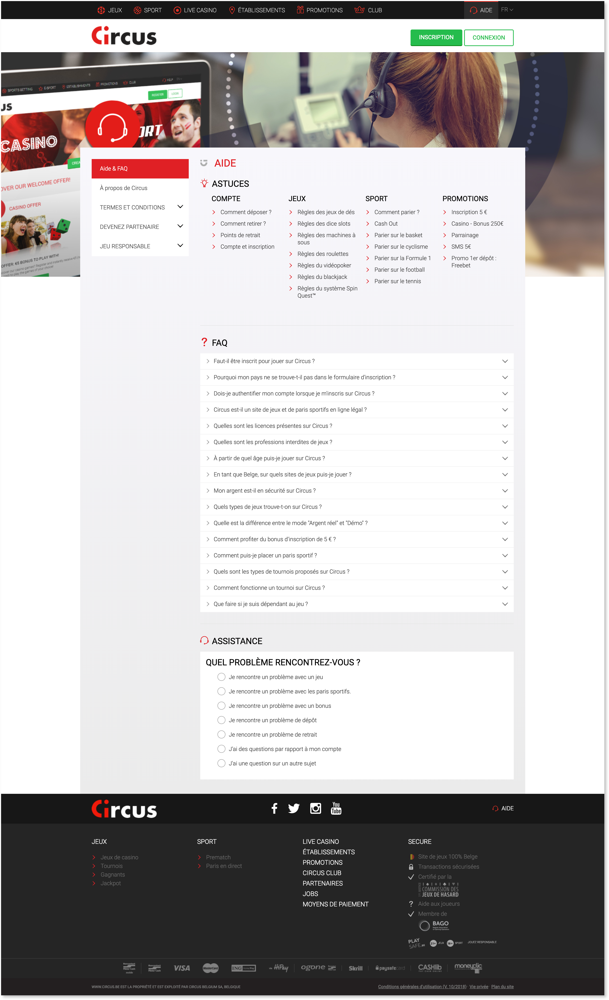
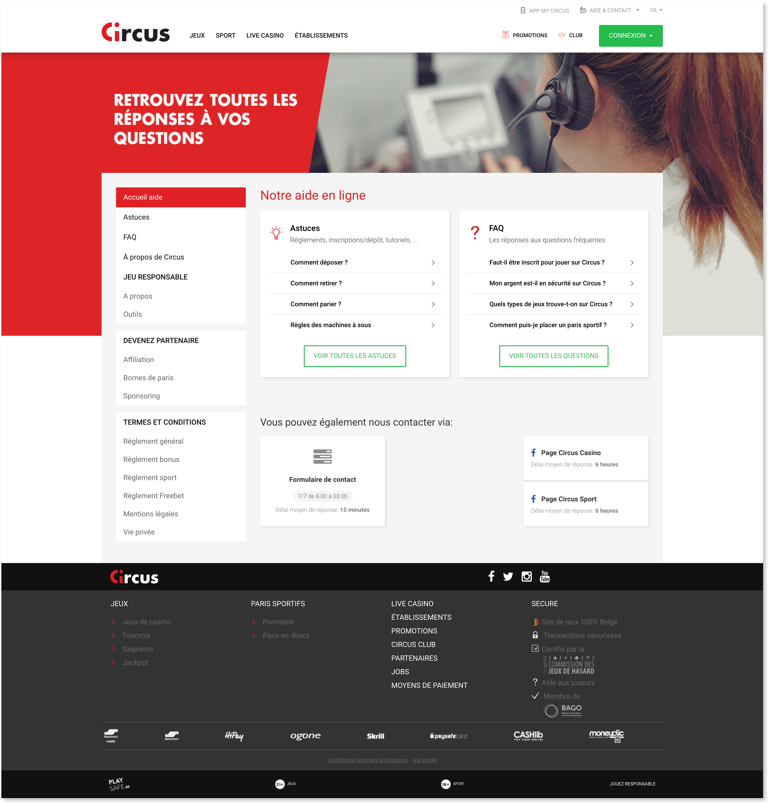
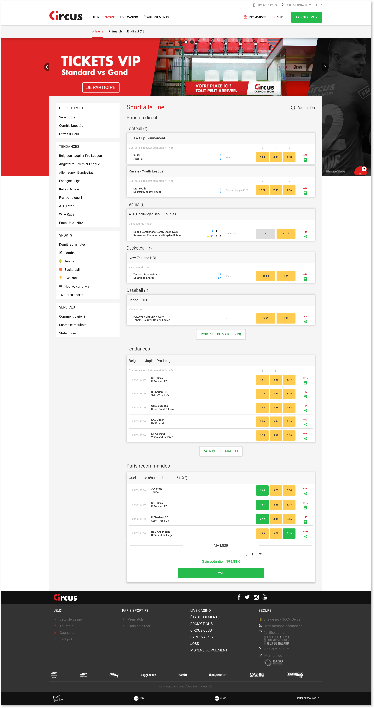

Context of the project: GAMING1 wanted, in addition to continue its updates and improvements on its current platform of gambling Circus (which is declined for its international partners), to start from scratch and rethink all of theirs features and the way they saw their product. It is the opportunity for them to considerate the actual trends and to step further into the future of technology possibilities to be up to date and stand up above their competitors.
The main idea was to be able to propose a catalog system with modular features that their partners can cherry pick up to add to their own platform (which is provided by GAMING1)

Here are some improvements made on the existing platform

	

    	

		

    

    

        

		

    

    

        

		

        
    

    

		

		

	

