## Context of the project
Sodexo recently gains the call for offer coming from the three different areas of Belgium (Wallonia, Flanders, Brussels) to be the only service provider of the service vouchers. 
They already gained it several years before that’s why they already had platforms and apps which provided the service needed from the regions. The main goal was to, based on what they had, completely rethink and redo the platforms and mobile apps with a strong UX focus and accordingly with a lot of constraints from the 3 different specifications (for each region).
My mission consisted in understanding the current platforms and apps, its features and the whole life cycle of the services vouchers from each side: the citizens, the providers, the workers and Sodexo. Then, to be able to help them to propose new platforms and apps with a lot of improvements compared to the previous ones. The challenge was to deliver 2 platforms and 2 apps in less than 6 months.

## Citizens

### Plateform Web
I decided to read and analyze all the data already gathered and to review all the current screens and flows. Then, I decided to review the content organization and hierarchy, that’s why I did some ideation with the experts of the field and then I ran some card sorting and tree testing. I took the opportunity of these tests to ask some questions about the weakness and strength of the current platform. I sorted out the most important content of the platform for the citizens and elaborated a content hierarchy, then, the whole architecture. After that, I did some ideation and small workshop for each big feature. With the results, I did some drafts and wireframes which become a base to discuss with the product owners, the UIs and some concerned developers. After some iterations, I created some usable prototypes, which once validated by all, could be designed by the UIs. Then, it had to be submitted to the region, which were often the time to discuss and defend the proposition that was made, considering the dev capacity, the constraints and the time allowed. I regularly did some review of the screens made (in Zeplin) to be sure that the applied design matched the UX view.
In production, I ran some beta tests and prepared and monitored a UX diary survey. I also prepared a survey with a set of questions for when they will feel the need to receive some feedbacks about their new platform.

	

    	
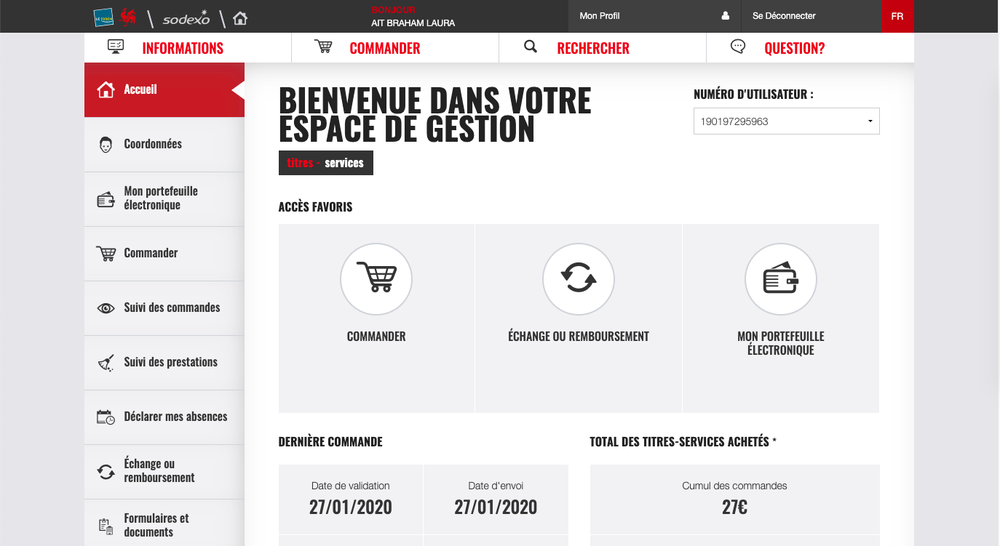

		
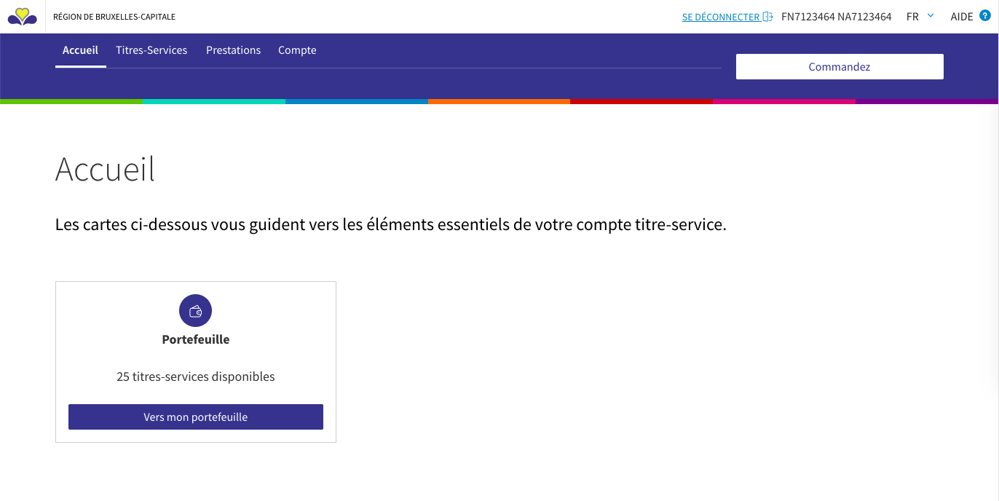

    

    

        
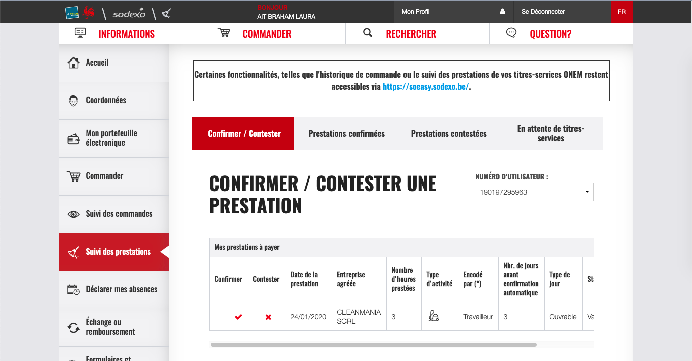

		
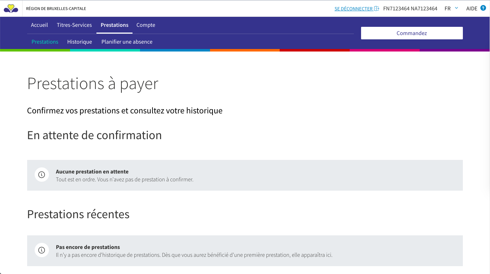

    

    

        
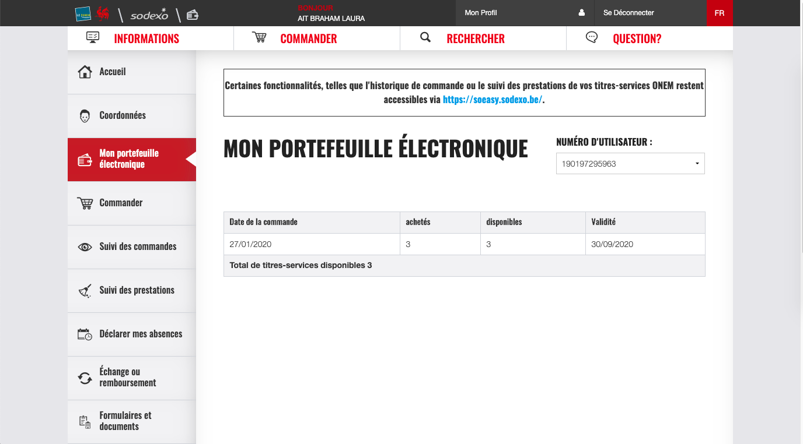

		
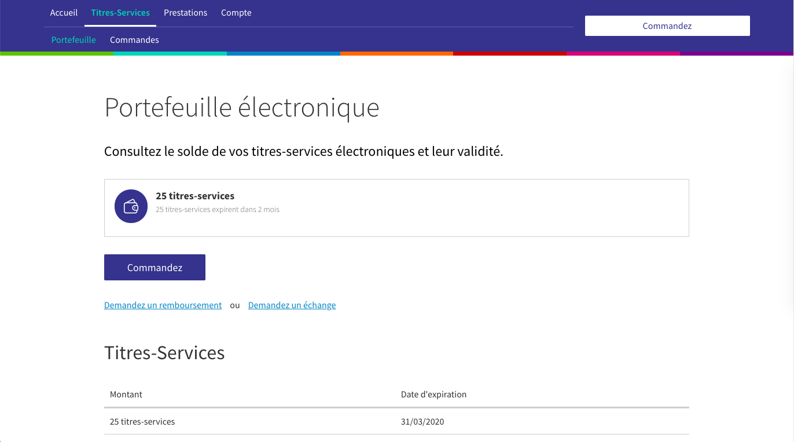
        
    

### Mobile App
I decided to review all the current screens and flows of the current app and to read all the comments on the app store. Then, I decided to review the content organization and hierarchy – according to what I previously did for the platform. For the app, I did some benchmarking of the trends in the mobile app field. Then, I sorted out the app architecture and navigation.
After that, I did some ideation with the product owners, experts, UIs, developers for each big feature with some drafts and wireframes of how I pictured them. After some iterations, I created some usable prototypes, which once validated by all, could be designed by the UIs. Then, it had to be submitted to the region, which were often the time to discuss and defend the proposition that was made, considering the dev capacity, the constraints and the time allowed. I regularly did some review of the screens made (in Zeplin) to be sure that the applied design matched the UX view.
In production, I ran some beta tests and prepared and monitored a UX diary survey. I also prepared a survey with a set of questions for when they will feel the need to receive some feedbacks about their new mobile app.

	

    	
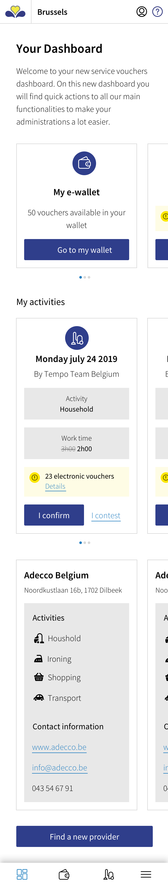

		
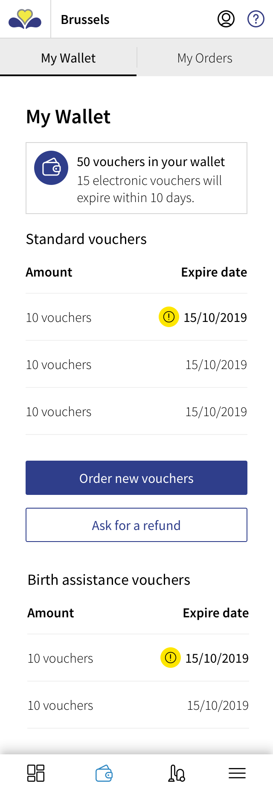

    

    

        
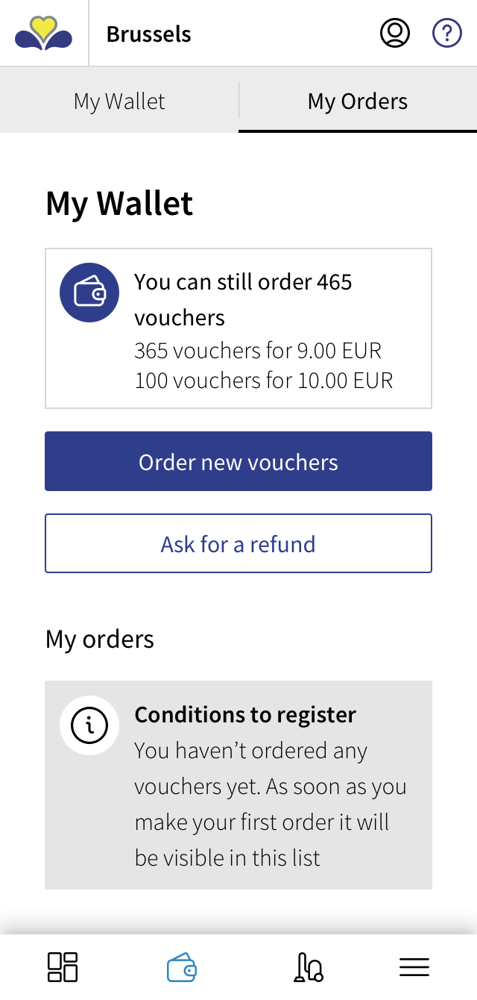

		
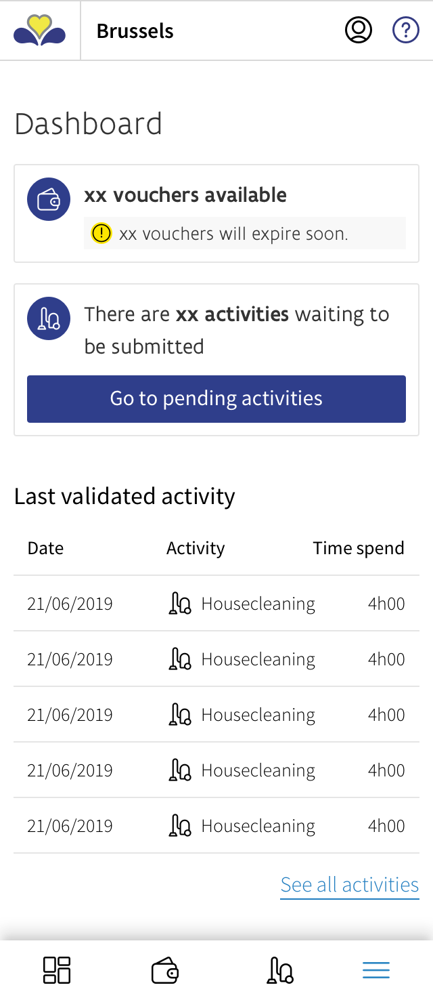

    

## Providers
I decided to meet the experts of the field and to analyze the process of an enterprise in its daily basis. I did some drafts of the services vouchers cycle in an enterprise to understand better the importance of the features.
Then, I decided to review all the screens and flows previously made. For the content organization and hierarchy, I did some ideations with the experts of the field and then I ran some card sorting and tree testing. I took the opportunity of these tests to ask some questions about the weakness and strength of the current platform.
I sorted out the most important content of the providers’ platform and elaborated a content hierarchy, then, the whole architecture according to my researchs on the most used features/actions. After that, I did some ideation and small workshop for each big feature. With the results, I did some drafts and wireframes which become a base to discuss with the product owners, the UIs and some concerned developers. After some iterations, I created some usable prototypes, which once validated by all, could be designed by the UIs. Then, it had to be submitted to the region, which were often the time to discuss and defend the proposition that was made, considering the dev capacity, the constraints and the time allowed. I regularly did some review of the screens made (in Zeplin) to be sure that the applied design matched the UX view.
I ran some tests on the biggest features and prepared a survey with a set of questions for when they will feel the need to receive some feedbacks about their new platform.

## Workers
I decided to meet the experts of the field and to review the current application which only consisted of 5 to 6 screens. I read the comments on the app store to start gathering feedbacks. The real challenge here was to keep an easy and simple app while adding more features and more actions to do for the user. I did a first draft of the map of the new app with all the features included. Then, I did some ideation with the product owners and the experts to discuss about the flows of the main features.
I made some wireframes and usable prototypes of each flow to discuss with the product owners, UIs and some concerned developers. After some iterations, once validated by all, they could be designed by the UIs. Then, it had to be submitted to the region, which were often the time to discuss and defend the proposition that was made, considering the dev capacity, the constraints and the time allowed. I regularly did some review of the screens made (in Zeplin) to be sure that the applied design matched the UX view. I met real workers to invite them to execute simple tasks and to give me their feeling about the look and the usability of the new application compared to the old one. I took the opportunity of these tests to ask some questions about the weakness and strength of the current app and what they would add if they could. 
I prepared a survey with a set of questions for when they will feel the need to receive some feedbacks about their new application.

	

    	

		
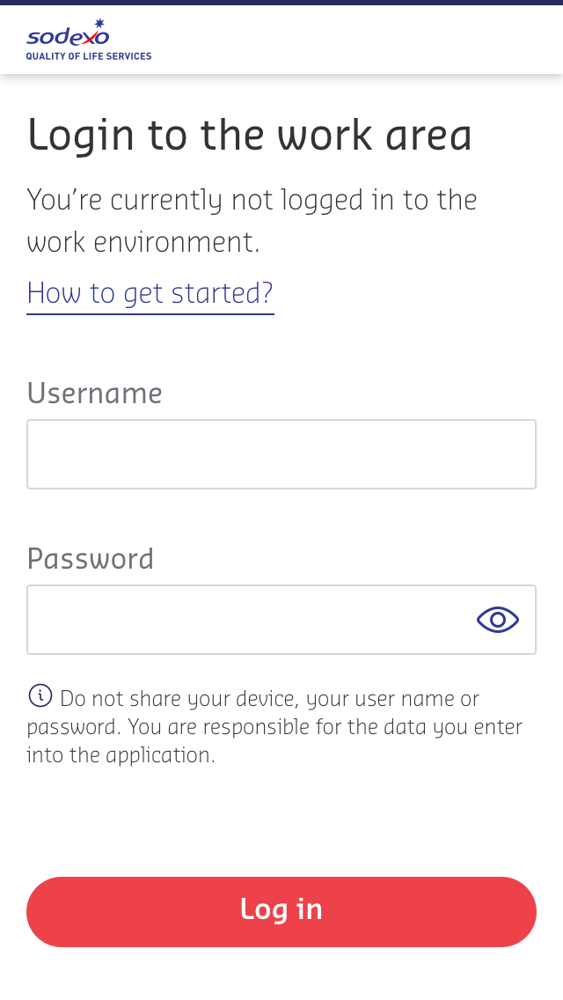

    

    

        
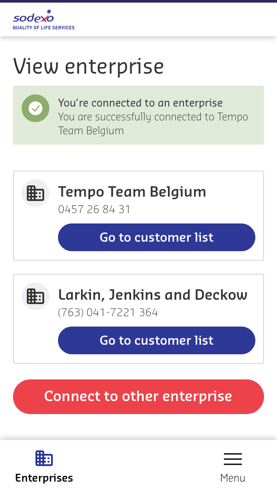

		
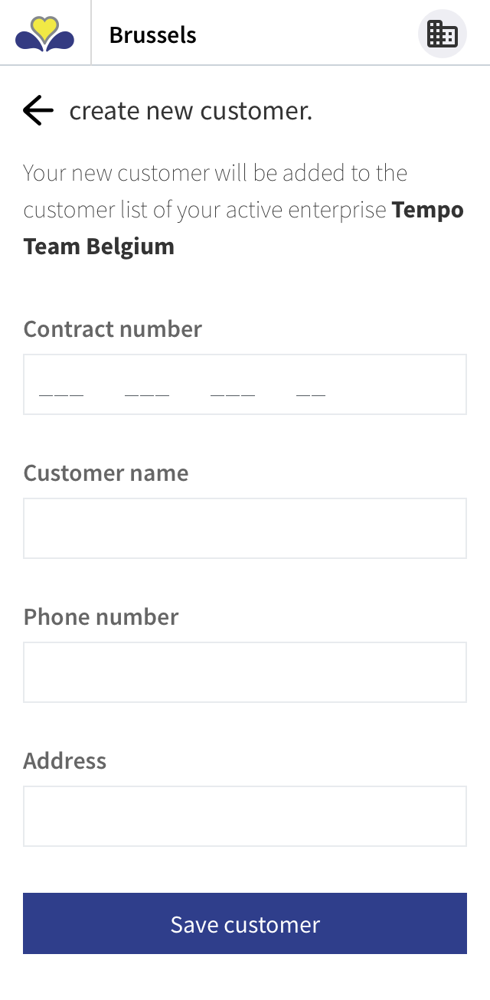

    

    

        
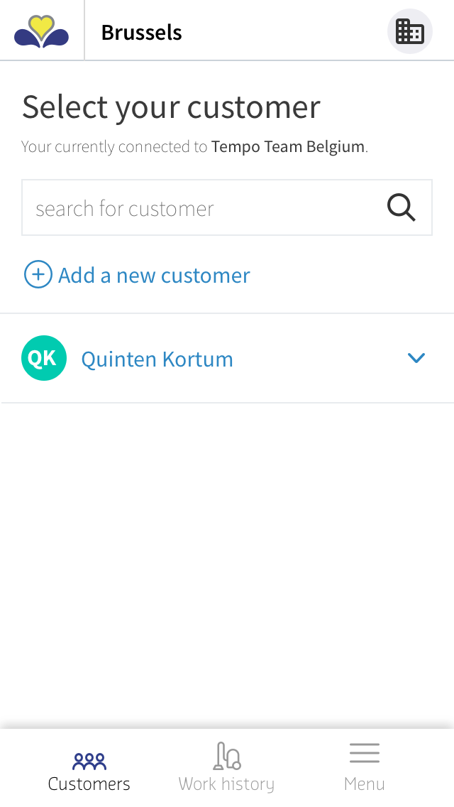

		
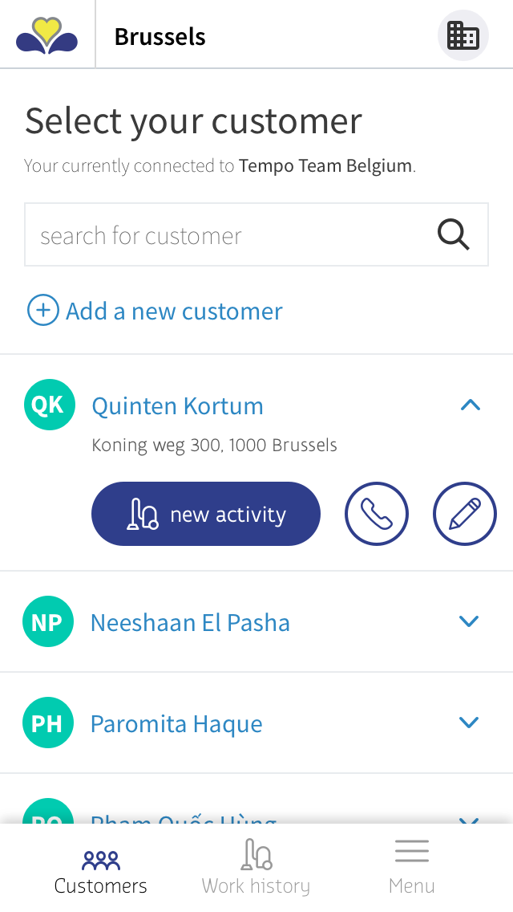

    

    

        
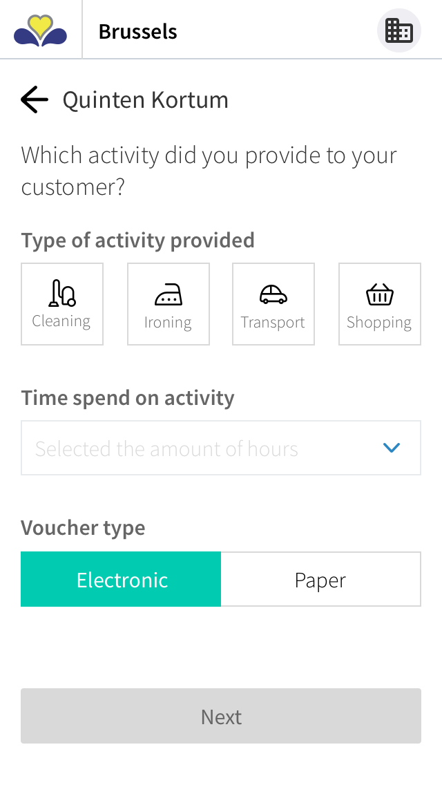

		
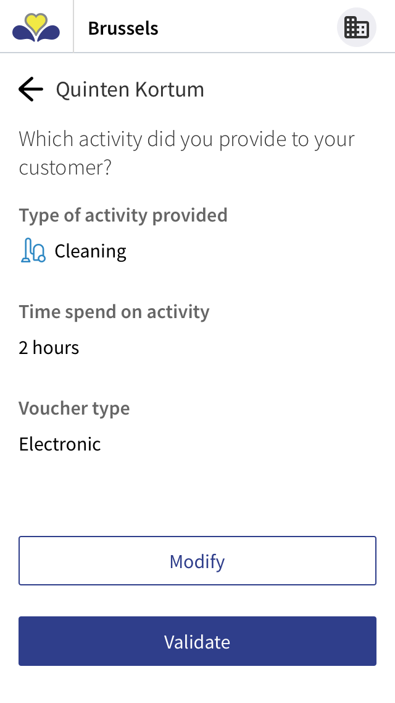

    

